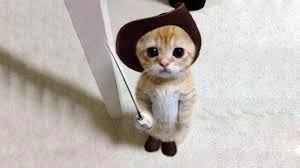


 

<head>
  
</head>

<body>
    

    <h4>⋆ ⭒ ˚ . ⋆  ⋆ ⭒ ⋆🪐˚ . ⋆⋆ ⭒ ˚ .  ⋆ ⭒ ˚ . ⋆⋆ ⋆🪐⭒ ˚ . ⋆⋆ ⭒ ˚ . ⋆. ⋆ ⋆ ⭒⋆ ˚ . ⋆ ⭒ ˚ .  </h4>
    <h1 style="color:dark blue;"> Joanna's page!</h1>
    <h4>˚. ୭ ˚ ○ ◦ ˚.˚ ◦ ○˚ ୧ .˚ₓ ˚. ୭ ˚ ○ ◦ ˚.˚ ◦ ○˚ ୧ .˚ₓ˚. ୭ ˚ ○ ◦ ˚.˚ ◦ ○˚ ୧ .˚ₓ</h4>
    

    

    

    

        

            <a href="https://www.youtube.com/watch?v=HMTKMWHLbdQ&ab_channel=Crunchycat" target="blank">

                 
            
</a>
            
Crunch along

        

        

            <a href="https://www.youtube.com/watch?v=Gnm3hIcjiCQ&ab_channel=Michi" target="blank">

                
            
</a>
            
Dance along

        

        

            <a href="https://www.youtube.com/watch?v=_fvNuap9l-Y&ab_channel=JamirJessR" target="blank">

                
            
</a>
            
Eat along

        

     
     

 
 

    

</body>
